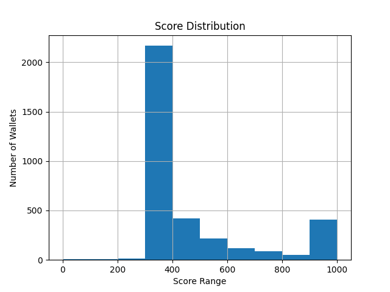

```markdown
```
##  analysis.md
# 📊 Credit Score Analysis of Aave V2 Wallets

## 🎯 Goal
To interpret the distribution of credit scores assigned to user wallets and assess behavioral differences between high- and low-scoring users.

---

## 🧮 Score Distribution



### Distribution Table:

| Score Range | Number of Wallets |
|-------------|-------------------|
| 0–100       | ~0                |
| 100–200     | ~0                |
| 200–300     | ~500              |
| 300–400     | ~2200             |
| 400–500     | ~400              |
| 500–600     | ~250              |
| 600–700     | ~125              |
| 700–800     | ~75               |
| 800–900     | ~50               |
| 900–1000    | ~400              |

---

## 🧍‍♂️ Behavior of Low-Scoring Wallets (0–400)

- High number of liquidations
- Poor repayment behavior (low or zero repay-to-borrow ratio)
- Minimal deposits or interactions
- Likely bot-like or exploitative activity

---

## 🧑‍💼 Behavior of High-Scoring Wallets (700–1000)

- Frequent deposits and repayments
- Very high repay-to-borrow ratio (often 1.0)
- No or minimal liquidation events
- Likely active, responsible, and reliable DeFi users

---

## 🔍 Insights

- Most wallets fall in the **300–400** range, indicating moderate or limited positive engagement.
- Very few users score below 300 — suggesting liquidation behavior is less common.
- ~400 wallets scored above 900, indicating a substantial cohort of high-performing users.
- The score distribution is **right-skewed**, confirming that high reliability is relatively rare but well-recognized.

---

## ✅ Conclusion

This scoring system successfully captures key behavioral patterns in DeFi activity:
- **Repayment behavior and liquidation avoidance** are strong indicators of responsibility.
- Scores can be extended for fraud detection, user segmentation, or lending risk assessment in decentralized finance.

